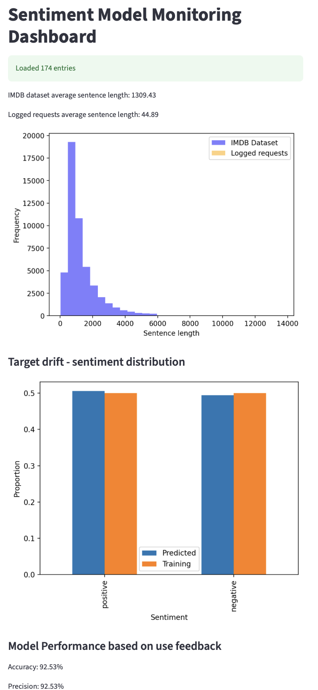

# Model-Monitoring

README.md: Your README must be updated to explain the new multi-container architecture and provide clear, step-by-step instructions on how to use the Makefile to run the entire stack. 

!!!!!!!!!
It must also include curl examples for the API and instructions for the evaluate.py script.

# Sentiment Model Monitoring
---

### **DESCRIPTION**

This project extends the sentiment analysis API by adding **model monitoring** capabilities using FastAPI, Streamlit, and Docker. There are deployed separately:

- **FastAPI Prediction Service:** Serves predictions and logs requests to shared log file.
- **Streamlit Monitoring Dashboard:** Visualizes performance metrics and data drift using logs.

The two services are run as separate Docker containers, sharing a volume to communicate log data.

---

### **STRUCTURE**

| File/Folder         | Purpose                                              |
|---------------------|------------------------------------------------------|
| `api/`              | FastAPI application for serving sentiment predictions |
| `monitoring/`       | Streamlit dashboard that monitors predictions         |
| `logs/`             | Shared folder to store `prediction_logs.json`        |
| `evaluate.py`       | Script to send test requests and collect accuracy     |
| `test_data.json`    | Dataset used to evaluate predictions                  |
| `Makefile`          | Automates build, run, clean for both services         |
| `README.md`         | Project documentation                                 |

---

### **FASTAPI SERVICE**

| Method | Endpoint         | Description                                           |
|--------|------------------|-------------------------------------------------------|
| GET    | `/health`        | Returns `"status": "ok"` to verify the service is live |
| POST   | `/predict`       | Accepts text and returns sentiment prediction         |

#### Example: POST /predict

Request:
```json
{
  "text": "This movie was excellent!",
  "true_sentiment": "positive"
}
```

Response:
```json
{
  "predicted_sentiment": "positive"
}
```

Each request is logged with timestamp, input text, prediction, and true sentiment.

---

### **STREAMLIT MONITORING DASHBOARD**

Available at: [http://localhost:8501](http://localhost:8501)

This dashboard reads from `logs/prediction_logs.json` and displays:

#### Data Drift Analysis:
- Compares sentence lengths from training data vs logged requests.

#### Target Drift:
- Compares sentiment distribution in predictions vs original dataset.

#### Model Performance:
- Calculates **accuracy** and **precision** from logged feedback.

#### Alerts:
- Displays warning if accuracy falls below 80%.


Should look something like this depending on your data.

---

### **HOW TO RUN LOCALLY**

#### 1. Clone the repository
Clone the repo from GitHub

#### 2. Build the Docker images

```bash
make build-api
make build-monitor
```

#### 3. Run the services (in separate terminals)

Start FastAPI:
```bash
make run-api
```

Start Streamlit:
```bash
make run-monitor
```

---

### **EVALUATION SCRIPT**

Run `evaluate.py` in a third terminal to send test data and simulate user feedback:

```bash
python evaluate.py
```

This will:
- Send requests from `test_data.json` to the API
- Log predictions and true labels
- Report model accuracy

---

### **CURL EXAMPLES**

Send a prediction:

```bash
curl -X POST http://localhost:8000/predict \
-H "Content-Type: application/json" \
-d '{"text": "The movie was fantastic!", "true_sentiment": "positive"}'
```

Check API health:

```bash
curl http://localhost:8000/health
```

---

### **CLEANUP**

To remove Docker images and reset:

```bash
make clean
```

---

### **NOTES**

- Both services read/write to `/logs/prediction_logs.json`
- Docker bind mount makes local logs persist and makes them visible to both containers
- No frontend (as specified) — use Postman or `evaluate.py` for requests

---
